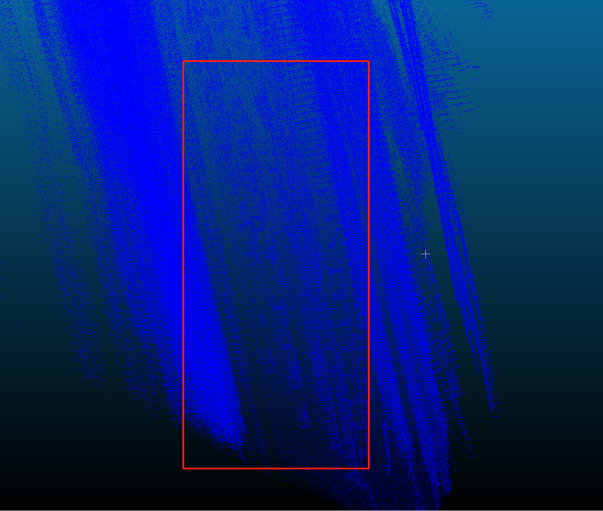
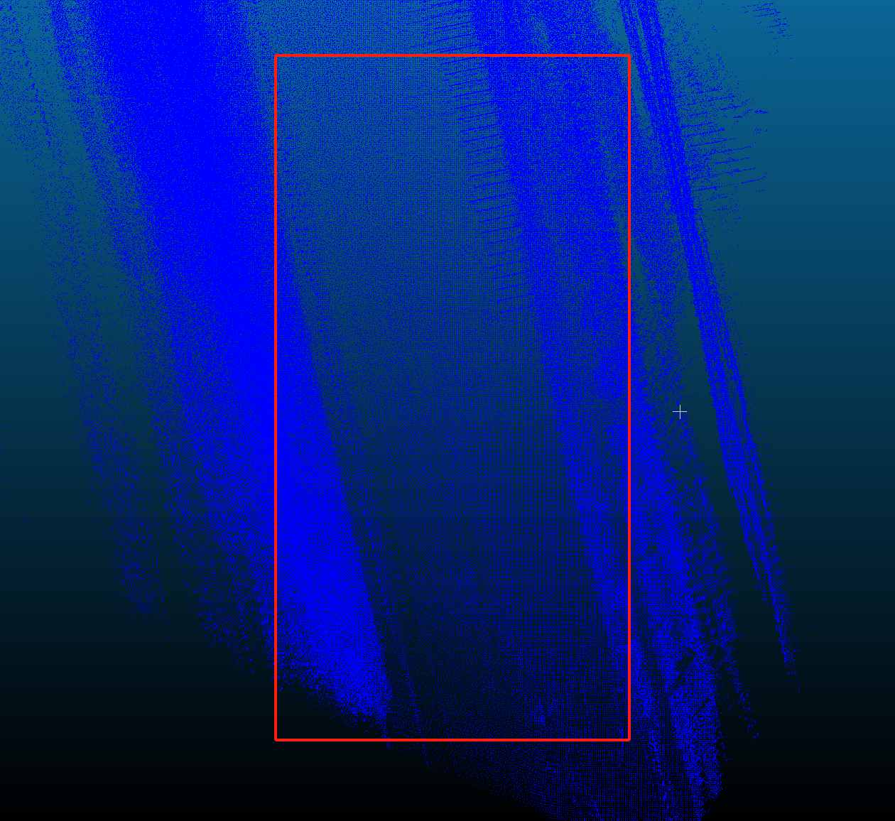

# :rainbow: ERASOR (RA-L'21 with ICRA Option)

Official page of [*"ERASOR: Egocentric Ratio of Pseudo Occupancy-based Dynamic Object Removal for Static 3D Point Cloud Map Building"*](https://ieeexplore.ieee.org/stamp/stamp.jsp?tp=&arnumber=9361109), which is accepted by RA-L with ICRA'21 option 
[[Video](https://www.youtube.com/watch?v=Nx27ZO8afm0)] [[Preprint Paper](https://arxiv.org/abs/2103.04316)] 

#ERASOR Data Cnversion Toolkit
## 🗂️ Core Files

| File | Purpose | Location |
|------|---------|----------|
| PCD+TF→ROS Bag | Converts point clouds with TF data | [`scripts/semantickitti2bag/to_ros_bag.py`]|
| ROS Bag→ERASOR Bag | Formats bag for ERASOR algorithm | [`scripts/semantickitti2bag/to_erasor_data.py` ]|
##📊 Results & Visualizations
<table>
  
  <tbody>
    <tr align="center">
      <td> before </td><td> after </td>
    </tr>
  </tbody>
  <tbody>
    <tr>
      <td> 

 </td>
      <td> 

 </td>
    </tr>
  </tbody>
  
</table>
## Citation 
If you use our code or method in your work, please consider citing the following:

	@article{lim2021erasor,
    title={ERASOR: Egocentric Ratio of Pseudo Occupancy-Based Dynamic Object Removal for Static 3D Point Cloud Map Building},
    author={Lim, Hyungtae and Hwang, Sungwon and Myung, Hyun},
    journal={IEEE Robotics and Automation Letters},
    volume={6},
    number={2},
    pages={2272--2279},
    year={2021},
    publisher={IEEE}
    }

